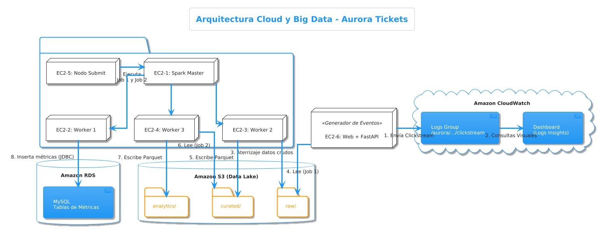

#  Aurora Tickets - Big Data & Cloud Architecture


Este repositorio contiene la arquitectura Big Data end-to-end diseñada para **Aurora Tickets**, una plataforma de venta de entradas. El proyecto centraliza, procesa y visualiza grandes volúmenes de datos (Clickstream y transaccionales) para obtener métricas clave de negocio y detectar tráfico anómalo (bots).

##  Arquitectura del Proyecto

El proyecto está desplegado íntegramente en AWS utilizando un modelo de Data LakeHouse estructurado en 3 capas (Raw, Curated, Analytics).

* **Ingesta y Logs:** AWS CloudWatch (Logs + Insights).
* **Almacenamiento (Data Lake):** Amazon S3 (formato Apache Parquet, particionado por fecha).
* **Procesamiento Distribuido:** Clúster Apache Spark (Standalone) sobre 6 instancias Amazon EC2 (Ubuntu).
* **Almacenamiento Analítico:** Amazon RDS (MySQL).
* **Visualización:** CloudWatch Dashboard operativo en tiempo real.



##  Estructura del Repositorio

```text
 aurora-tickets-bigdata
 ┣  src                    
 ┃ ┣  job1_curation.py     
 ┃ ┗  job2_analytics.py    
 ┣  docs                   
 ┃ ┣  CRISPDM_1_Business.md
 ┃ ┣  CRISPDM_2_Data.md
 ┃ ┣  CRISPDM_3_Prep.md
 ┃ ┣  CRISPDM_4_Modeling.md
 ┃ ┣  CRISPDM_5_Evaluation.md
 ┃ ┗  CRISPDM_6_Deployment.md
 ┣  evidence               
 ┃ ┗  ...
 ┗  README.md
```

##  Productos Analíticos (Outputs)

El procesamiento en Spark genera 3 productos principales basados en los KPIs de negocio:

1. **Funnel de Conversión Diario:** Mide el paso a paso de los usuarios (`sesiones` -> `vistas al detalle` -> `inicios de checkout` -> `compras`).
2. **Ranking de Eventos (ROI):** Cruza la visibilidad de un evento con los ingresos reales generados.
3. **Detección de Anomalías (Seguridad):** Identifica direcciones IP que realizan peticiones masivas en intervalos cortos, marcándolas como posibles bots.

##  Reproducibilidad (Cómo ejecutar end-to-end)

Para reproducir este entorno, es necesario levantar el clúster de 6 máquinas EC2 y tener configuradas las credenciales de AWS. Una vez el Spark Master y los 3 Workers estén activos, los jobs se lanzan desde el Nodo Submit.

**1. Ejecutar Fase de Curación (Job 1):**

```bash
spark-submit \
  --master spark://<IP_PRIVADA_DEL_MASTER>:7077 \
  --deploy-mode client \
  --executor-memory 1G \
  --total-executor-cores 3 \
  /home/ubuntu/jobs/job1_curation.py
```
**2. Ejecutar Fase Analítica (Job 2):**

```bash
Requiere el conector JDBC de MySQL para volcar los resultados en Amazon RDS.

spark-submit \
  --master spark://<IP_PRIVADA_DEL_MASTER>:7077 \
  --deploy-mode client \
  --packages mysql:mysql-connector-java:8.0.28 \
  /home/ubuntu/jobs/job2_analytics.py
```
## Documentación Completa

La documentación técnica completa, incluyendo el diccionario de datos, el análisis de costes y las reglas de validación matemática, se encuentra desglosada siguiendo la metodología CRISP-DM en la carpeta /docs/.
