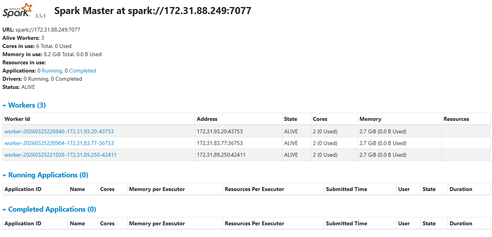

# Fase 2: Data Understanding

Para montar todo esto, he tenido que unir dos mundos de datos completamente distintos.

Por un lado, tengo los **datos de Clickstream** (el rastro que deja el usuario). Esto me llega en formato JSON Lines, generado tanto por el front como por el backend de la web. Aquí viene información como la IP, el `session_id`, en qué momento exacto (`timestamp`) hace clic y a qué endpoint (URL) va.

Por otro lado, tengo los **datos de negocio** en 3 archivos CSV:

* `events.csv`: El catálogo de los eventos con sus precios.
* `campaigns.csv`: Las campañas de marketing.
* `transactions.csv`: Las compras que se han hecho realmente.

Para que quede totalmente documentado, este es el diccionario de datos exacto con el que he tenido que pelearme. He analizado cada campo para saber qué me servía y qué no:

## Esquema del Clickstream (JSON)

* `student_id`: Mi identificador como alumno para aislar mis logs.
* `session_id`: Alfanumérico único. Es la clave principal para trazar el embudo.
* `event_type`: Me dice si el usuario hizo un *view* (vista), un *click*, o un *begin_checkout*.
* `event_id`: El ID del concierto o festival (solo aparece si están en la página de un evento concreto).
* `ip`: Fundamental para rastrear a los bots.
* `endpoint`: La URL exacta que están pisando en ese milisegundo.
* `timestamp`: La marca de tiempo en formato ISO.

## Esquema de los datos de Negocio (CSV)

* **Tabla Events:** `event_id` (Clave primaria), `name` (Nombre del festival), `base_price` (Precio, aquí detecté valores negativos que tuve que limpiar), `category`.
* **Tabla Campaigns:** `utm_campaign` (El nombre de la campaña publicitaria), `discount_rate` (Descuento aplicado).
* **Tabla Transactions:** `transaction_id`, `session_id` (Clave foránea para unir con el clickstream), `event_id`, `revenue` (Dinero final cobrado).

En la imagen de abajo se puede ver un ejemplo de los datos internos de un clic, eso nos confirma que se han creado correctamente.

En total, para simular un entorno real y ver cómo evoluciona a lo largo del tiempo, he generado más de 200.000 eventos de clickstream que cubren una semana completa (7 días).
