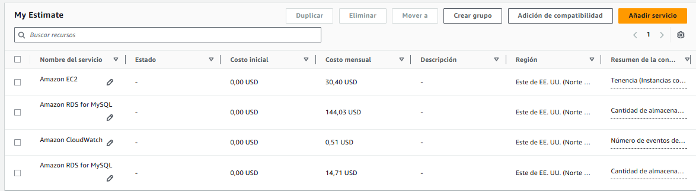
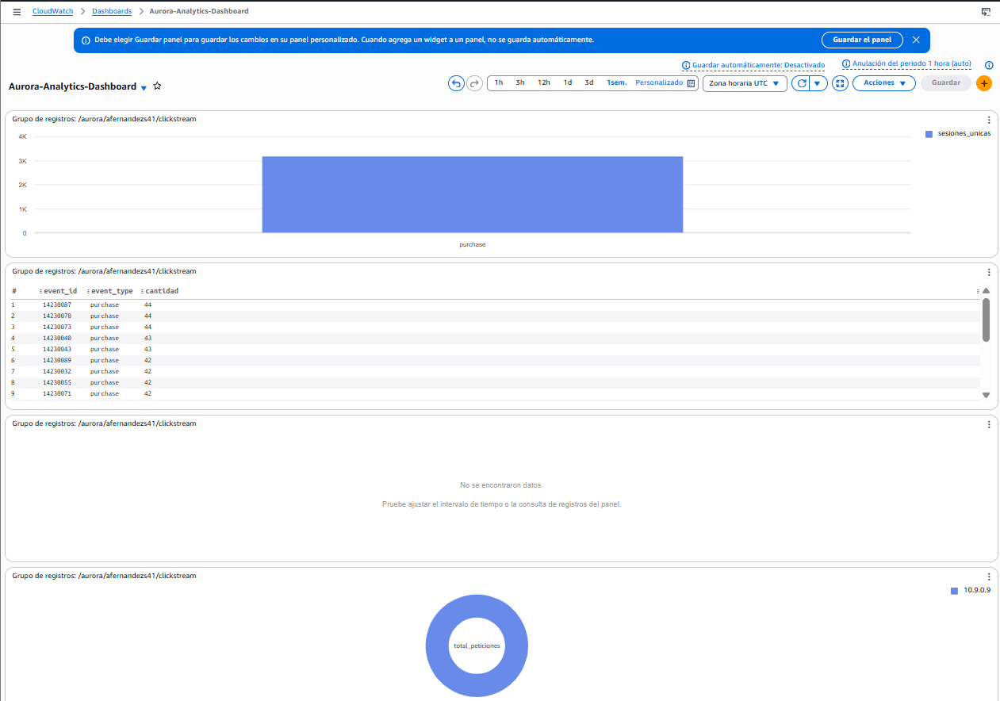

# Fase 3: Data Preparation

Los datos llegan "sucios" a la carpeta `raw` de mi Data Lake en S3. Mi trabajo en esta fase ha sido crear un script en PySpark (el Job 1) para limpiarlos y dejarlos listos en la capa `curated`.

## ¿Qué limpieza he hecho?

* **Nulos y errores intencionados:** En los CSV había basura. He programado filtros en Spark para cargarme los importes negativos (nadie compra una entrada por -20€) y las fechas que se salían de mi semana de análisis.
* **Huérfanos:** He cruzado las transacciones con el catálogo de eventos. Si una compra hacía referencia a un `event_id` que no existía, la he descartado.
* **Tipos de datos:** He forzado a que las fechas sean formato `Timestamp` y los precios formato `Float`, porque si lo dejaba como texto, luego no iba a poder hacer operaciones matemáticas.

Para que se vea claramente cómo he aplicado esta lógica, he desarrollado el **Job 1 en PySpark**. No he hecho la limpieza a mano, he creado un pipeline automatizado. Aquí muestro un fragmento de la lógica real que he utilizado para purgar los datos sucios:

```python
# Fragmento del Job 1: Limpieza de datos en PySpark
from pyspark.sql.functions import col, to_timestamp

# 1. Eliminar precios negativos y nulos del catálogo
df_events_clean = df_events.filter((col("base_price") > 0) & (col("base_price").isNotNull()))

# 2. Casteo de fechas y limpieza de transacciones
df_transactions_clean = df_transactions.withColumn(
    "transaction_date", to_timestamp(col("date_string"))
).filter(col("revenue") > 0).dropna(subset=["session_id", "event_id"])

# 3. Cruce del Clickstream con el catálogo asegurando integridad
df_clickstream_enriched = df_clickstream.join(
    df_events_clean,
    on="event_id",
    how="left"
)
```
Como se ve en el código, he sido muy estricto con los nulos. Si una transacción no tiene un `session_id`, no me sirve de nada porque no puedo unirla al comportamiento del usuario en la web, así que la descarto (`dropna`).

Una vez todo estaba cruzado y limpio, lo he guardado en S3.





Como se ve en las capturas, he decidido guardar los datos en formato **Apache Parquet**. Esto no es casualidad: Parquet comprime muchísimo y es columnar, lo que hace que Spark lo lea súper rápido. Además, he hecho un particionado por la fecha (`dt=YYYY-MM-DD`). Esto es vital porque si el día de mañana Aurora Tickets tiene años de datos, mis consultas solo leerán la carpeta del día que me interesa, ahorrando muchísimo tiempo y dinero en AWS.
