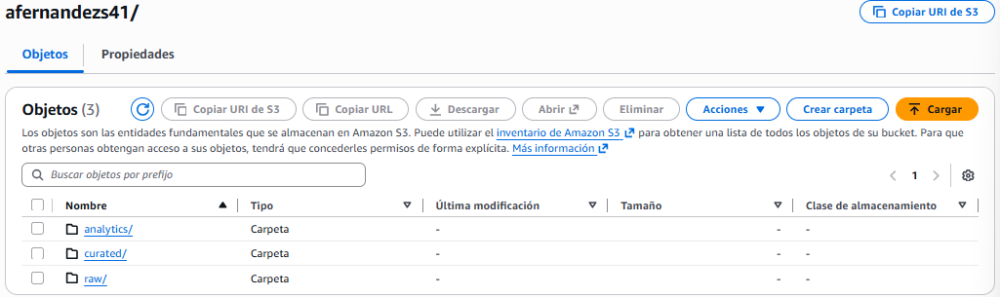
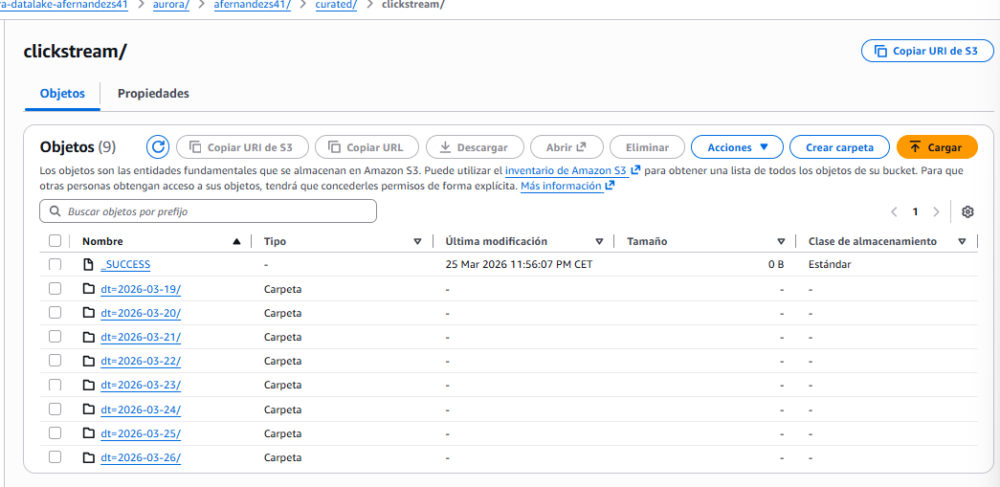

# Fase 4: Modeling

Una vez tengo los datos limpios en la capa `curated`, he diseñado el Job 2 de Spark para calcular los productos analíticos y llevarlos a la capa final (`analytics`).

He programado 3 lógicas principales:

1. **Producto A (Funnel diario):** Agrupo todo por día y por sesión. Cuento cuántas sesiones totales hay, cuántas han ido al detalle del evento, cuántas inician el checkout y cuántas acaban en `purchase`.
2. **Producto B (Ranking de eventos):** Hago un cruce (JOIN) entre las visitas de cada evento y el dinero total que han dejado, sacando un ratio para ver cuáles son más rentables.
3. **Producto C (Anomalías):** He creado una regla estática. Agrupo las peticiones por IP y por ventana de tiempo. Si veo un comportamiento anormalmente alto de peticiones al segundo, le pongo la etiqueta de "Suspected Bot".





Para visualizar esto, no me valía solo con tener tablas. He diseñado un Dashboard en CloudWatch con 4 consultas en *Logs Insights*. He elegido gráficos de barras para el embudo (porque se ve claramente cómo cae la gente en cada paso) y tablas/gráficos circulares para ver rápidamente a los bots y el ranking de eventos.

Para extraer la información en tiempo real desde CloudWatch, no he usado simples filtros, he tenido que programar consultas complejas en el lenguaje propio de **Logs Insights**.

Por ejemplo, para detectar el tráfico anómalo (los posibles bots) y generar el gráfico circular que avisa al equipo de Operaciones, he diseñado la siguiente consulta, que agrupa las peticiones por IP y cuenta cuántos errores están generando:

```text
# Consulta en Logs Insights: Detección de Anomalías (Bots)
filter @logStream like /clickstream/
| stats count(*) as TotalPeticiones, sum(if(status >= 400, 1, 0)) as TotalErrores by ip, endpoint
| filter TotalPeticiones > 100
| sort TotalPeticiones desc
| limit 20
```
Con esta query, le estoy diciendo a AWS: "Búscame todas las IPs que hayan hecho más de 100 peticiones de golpe, cuéntame cuántos errores de servidor han provocado y muéstrame las 20 peores". Es una herramienta potentísima para seguridad.
