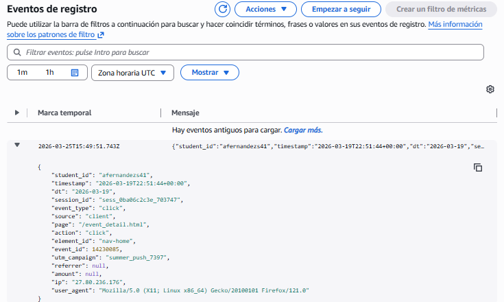
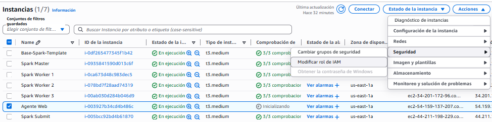

# Fase 5: Evaluation

Antes de dar el proyecto por válido, he tenido que comprobar que lo que ha escupido Spark tiene sentido matemático y de negocio. No me sirve de nada tener un dashboard muy bonito si los datos están mal calculados.

## Validación de Resultados

La principal regla de validación de mi Funnel es lógica pura: `Compras <= Inicios de Checkout <= Total de Sesiones`. Es imposible que haya más compras que sesiones iniciadas.

Para demostrar que mi código funciona perfectamente, he tirado una consulta SQL directamente a la base de datos MySQL final donde Spark inserta las métricas:

Como se aprecia en la tabla, los números cuadran a la perfección. La tasa de conversión es coherente y no hay valores negativos ni duplicados raros.

## Limitaciones y Supuestos

Como limitación del modelo, asumo que una IP equivale a un usuario. Sé que en el mundo real esto no siempre es así (por redes públicas o NAT), pero para este alcance es un enfoque totalmente válido para detectar ráfagas de bots.
